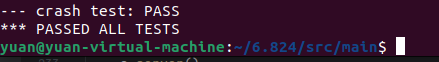

# mit_mapreduce

```bash
cd /src/main
go build -race -buildmode=plugin ../mrapps/wc.go
rm mr-out*
go run -race mrsequential.go wc.so pg*.txt
rm mr-out*
go run -race mrcoordinator.go pg-*.txt
go run -race mrworker.go wc.so // new window
bash test-mr.sh
bash test-mr-many.sh
```



